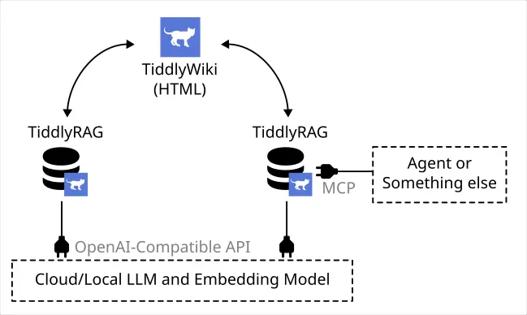
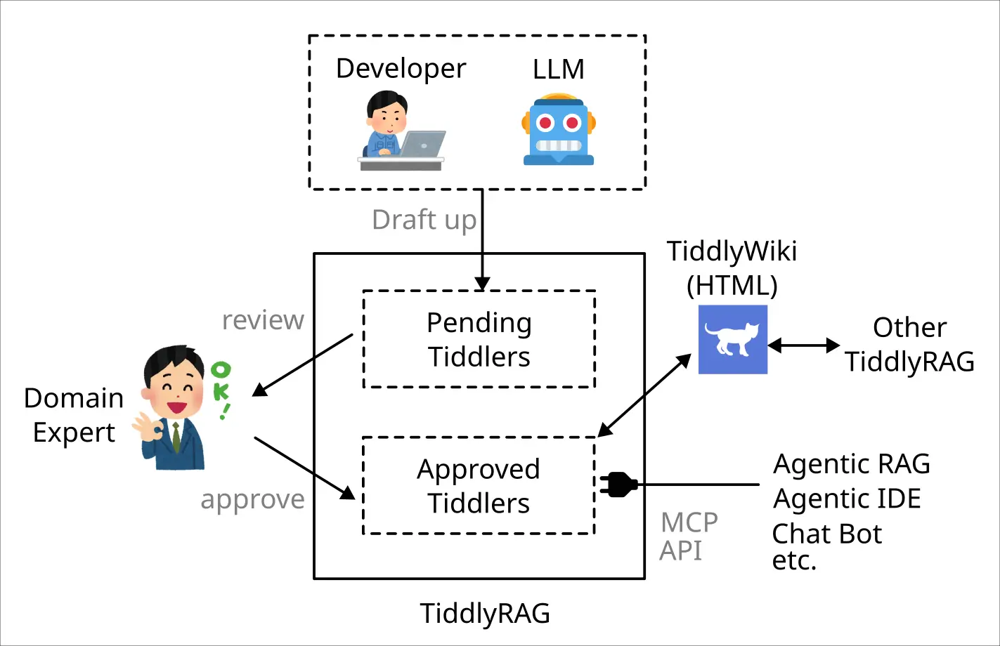

  

This repo is a TiddlyWiki containing information used as manual for development of TiddlyRAG.

## What's TiddlyRAG?

Check [long-story.md](./docs/long-story.md) for long story, and following is `TL;DR` version:

TiddlyRAG is a RAG microservice using TiddlyWiki as knowledge payload to improve flaw of `llm.txt`:

- Keep chunking information.
- Human readability.

---

With extra focus points which most LLM applications lack of:

- Knowledge audit.
- Knowledge feedback loop.

